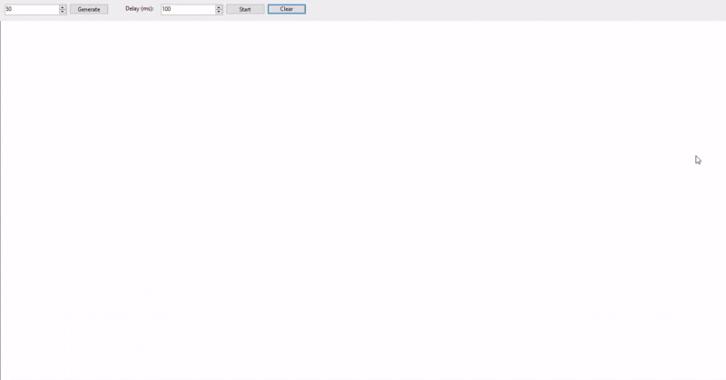

# Delaunay Triangulation (WinForms)

Реализация алгоритма построения триангуляции Делоне на плоскости с использованием графического интерфейса Windows Forms.

## 📌 Описание проекта
Данный проект представляет собой визуализатор инкрементального алгоритма триангуляции Делоне. Пользователь может интерактивно расставлять точки на холсте, а программа в реальном времени (или по нажатию кнопки) строит оптимальную триангуляцию, минимизирующую наличие узких треугольников.

## 🚀 Функциональные возможности
- **Интерактивный ввод:** Добавление точек левой кнопкой мыши.
- **Визуализация:** Отрисовка ребер треугольников и самих вершин.
- **Алгоритм:** Реализация метода Бойера — Ватсона (Bowyer–Watson).
- **Сброс:** Возможность очистить холст для построения новой сети.

## 🛠 Технический стек
- **Язык программирования:** C#
- **Технология:** Windows Forms (WinForms)
- **Графический движок:** GDI+ (`System.Drawing`)

## 👷 Демонстрация работы


## ⚙️ Как запустить
1. Склонируйте репозиторий:
   ```bash
   git clone https://github.com/LordPelmeha/DelaunayTriangulation.git
